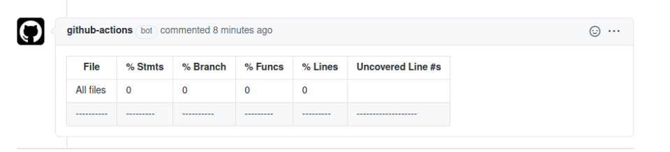

## About

Runs test command with nyc and posts coverage to pull request comments

- nyc must be listed as a dependencie on your package.json

## Inputs

### `command` **Required**

Command to run the tests </br>
Example: `"yarn test"`

### `GITHUB_TOKEN`

The GITHUB_TOKEN secret </br>
Default: `${{ github.token }}`

## Example usage

```yaml
name: "Code quality"
on: [pull_request]

jobs:
  check:
    runs-on: ubuntu-latest

    strategy:
      matrix:
        node-version: [12.x]

    steps:
      - uses: actions/checkout@v2

      - name: Use Node.js ${{ matrix.node-version }}
        uses: actions/setup-node@v1
        with:
          node-version: ${{ matrix.node-version }}

      - uses: bahmutov/npm-install@v1

      - name: Report test coverage
        uses: PoorlyDefinedBehaviour/nyc-reporter@v1
        with:
          command: "yarn test"
          GITHUB_TOKEN: ${{ secrets.GITHUB_TOKEN }}
```

## Preview


